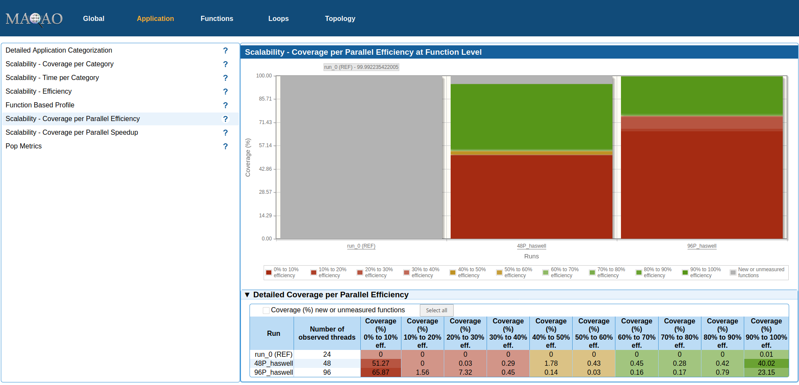

# MAQAO

[MAQAO](http://www.maqao.org/) (Modular Assembly Quality Analyzer and Optimizer) is a performance analysis and optimization framework operating at binary level with a focus on core performance.
Its main goal of is to guide application developers along the optimization process through synthetic reports and hints.

Since MAQAO operates at binary level, it is agnostic with regard to the language used in the source code and does not require recompiling the application to perform analyses.

As its name suggests, MAQAO is composed of several modules which are described [here](https://pop-coe.eu/blog/pop-tool-descriptions-uvsq-performance-tools). In this userinfo page, we focus on ONE View which is the module responsible for invoking the other modules and aggregating their results in a common report (in PDF, HTML or XLS format).

Users can easily write their own modules using the Lua scripting language, allowing fast prototyping of new MAQAO modules. More information about that topic can be found in the developers section of the [MAQAO documentation](http://www.maqao.org/documentation.html)

## Downloading MAQAO

MAQAO is not available as a module on our system at the moment. You need to download the MAQAO binary from the [official page](http://www.maqao.org/downloads.html). For this example we used the version 2.11.0 for Intel 64:

```
$ wget http://www.maqao.org/release/maqao.intel64.2.11.0.tar.xz
$ tar -C <destination_folder>/ --xz -xf maqao.intel64.2.11.0.tar.xz
```

For the rest of the document we will assume that MAQAO has been added to the path, that is, `maqao` will reference the path where the MAQAO binary is located.

## MAQAO ONE View usage

We strongly recommend that you have a look at the [official ONE View docummentation](http://www.maqao.org/release/MAQAO.Tutorial.ONEVIEW.pdf) as it is very clear and covers the usage and explanations of all the available features.

In this section we are going to try to follow the [POP performance assesment methodology](https://pop-coe.eu/sites/default/files/pop_files/whitepaperperformanceaudits.pdf) for a small example. Particularly we will profile the software [Alya](https://www.bsc.es/research-development/research-areas/engineering-simulations/alya-high-performance-computational) executed with the [elbow test](http://bsccase02.bsc.es/alya/elbow.zip).

Firstly we will discuss how to perform the profiling using MAQAO (i.e. execute the experiments), and then we will analyze the results generated by MAQAO ONE View.

**Important note:** in order to execute your program on the computing nodes of our system (e.g. Broadwell nodes, Haswell nodes,...) MAQAO must be configured to launch the experiments using the SLURM workload manager. In the next subsection we explain how to do it.

### Preparing the experiments

The experiments can be configured using a configuration file which uses the Lua syntax. A template configuration file can be generated with the following command

```
$ maqao oneview --create-config=config.lua
```

The generated configuration file contains all the available parameters (some of them commented with `--`) and it is fully documented. In this document we only cover a few of the parameters of the configuration file, so please refer to that generated template or [the MAQAO tutorial](http://www.maqao.org/release/MAQAO.Tutorial.ONEVIEW.pdf) for more details.

It is important to notice that variables can be referenced with `<name_of_variable>`.

MAQAO is compatible with any combination of MPI tasks and OpenMP threads, and it also allows the configuration of several experiments in one configuration file to perform scalability analysis.

Below we show and explain the variables that we modified for our experiment:

```lua
experiment_name = "Alya Elbow Test" -- Name of the experiment

binary			= "/nfs/admin/hpc/sw/alya/bin/Alya.x" -- Path to the binary that will be profiled

dataset			="elbow" -- Folder which contains the files needed for the execution

dataset_handler	= "copy" -- We indicate that we want to copy the dataset folder instead of creating a symbolic link to it
							-- With that we prevent modifications in the original folder

run_directory  = "<dataset>" -- Working directory of the SLURM job

run_command    = "<binary> elbow" -- Command used to run the binary. Depending on the program you are profiling the command line arguments may vary.

mpi_command    = "mpirun -n <number_processes>" -- It will be appended at the begining of the executed command. Used to specify a launcher for the application.

------------ SLURM related configuration

batch_script    = "alya_maqao_job.sh" -- Script to use with the job scheduler

batch_command   = "sbatch <batch_script>" -- Command used to add the job to SLURM queue

script_variables = { -- Specify user defined variables that are replaced in the batch_script file.
    run_partition="normal --constraint=haswell"	-- We want to run the binary on Haswell nodes
    -- Notice that here you can create as much variables as you want and reference them inside the SLURM job file.
}

------------ Reference experiment

number_processes = 24 -- Indicates the number of MPI processes

------------ Scalability analysis
-- Each set inside "multirun_params" represents an experiment.
-- Variables defined in each experiment will overrided the general value (given outside "multirun_params"). 
multiruns_params = {
  {
    number_processes=48,
    name="48 MPI processes, Haswell"
  },
  {
    number_processes=96,
    name="96 MPI processes, Haswell"
  }
}
```

And the file `alya_maqao_job.sh` is as follows:

```bash
#!/bin/bash
#SBATCH -n <number_processes>
#SBATCH -t 2:00:00
#SBATCH -J Alya_maqao
#SBATCH -p <run_partition>   # Reference the partition defined in "config.lua"

# Load required modules
module load pre2019
module load alya/hsw

# Prepare the experiment
export TESTCASE="alya_elbow"
export NNODES=$SLURM_JOB_NUM_NODES
export NPROC=$SLURM_NTASKS
export NTHREADS=$SLURM_CPUS_PER_TASK
export RESULTDIR=${SLURM_SUBMIT_DIR}/${SLURM_JOB_ID}_alya_maqao_${TESTCASE}_${NNODES}N_${NPROC}P_${NTHREADS}T
export WORKDIR=/scratch-shared/${USER}/${SLURM_JOB_ID}

mkdir -p ${WORKDIR}
cp elbow.* $WORKDIR

mkdir -p ${RESULTDIR}

cd $WORKDIR
pwd

# Launch the execution. This line must be always the same.
<mpi_command> <run_command>

# Recover the log file from the working dir
cp -r elbow.log $RESULTDIR
```

To sum up, we have prepared a set of experiments that:

- Will run on Haswell partitions.
- Contains a reference experiment which will use 24 MPI tasks.
- Contains two additional experiments which will enable an scalability analysis:
  - One with 48 MPI tasks.
  - One with 96 MPI tasks.

In order to run this example, simply execute the following command:

```
$ maqao oneview --create-report=one --config=config.lua --show-program-output --with-scalability
```

### Analyzing results

Once the execution finishes, MAQAO will generate a HTML report that can be accessed by opening the file `RESULTS/ Alya.x_one_html/index.html`.


For a full description the contents of the report, please refer to [the official ONEVIEW tutorial](http://www.maqao.org/release/MAQAO.Tutorial.ONEVIEW.pdf).

#### Application structure and regions of interest

On the home page are general information (experiment summary, configuration summary) and global metrics.

Notice that clicking on the labels in "Global Metrics" shows an associated plot on the right panel with more detailed information, and that placing the cursor over the labels shows a description of the metric.

Regarding the first three metrics:
- Clicking "Total Time" you can get a first idea of the evolution of execution time in the different experiments.
- Clicking "Time in loops" or "Time in innermost loops" shows plots whith information about the coverage of the loops of the application. This can be useful to identify possible regions of interest or bottlenecks.
  
  For example, in this graph, we can see that the 3% of the total execution time of our code corresponds to just one inner most loop, which is an indicative of a potential region of interest.
- Clicking "Time in user code" shows an overview of the proportion of time that is used by the binary itself, MPI and OpenMP communication, and other libraries. 

The other metrics give an idea of how efficient the code is, and the potential speedups that could be achieved by improving some aspects of the application.

In "Application" tab, the "Detailed Application Categorization" view to gives a general idea of the behavior of the application. It allows as to see the total execution time and the proportion of time that each process and thread spend on different categories of operations (MPI, OMP, IO, etc.).

In our example, we can see a mostly uniform and well balanced distribution of the work except for the MPI process rounded in red, for which the MPI portion is much bigger. This process is probably the one responsible of managing the communication between the other tasks.


Still in the "Application" tab, the "Function Based Profile" view show another useful plot for detecting regions of interest: the coverage at function level. In our example (see figure below), 2 functions corresponds to the 26% of the total execution time, and 8 functions  represent the 64% of the execution time. Therefore, this metric is indicating that we should consider these functions as regions of interest.


In order to determine which are these interesting functions, go to the "Functions" tab (see figure below) which provides a list with all used functions and their coverage. This allows us to identify which functions are consuming more execution time in our application, and in which module/library they are located.

For our example, we will consider as regions of interests the first two functions, which are part of the Alya binary: `for_cpstr` and `nsi_elmmat_.V`. For this list we can also highlight that the coverage deviation among threads ("Deviation (coverage)") is very small for all the functions that appear in this image except for `MPIDI_CH3I_Progress`, which presents a coverage deviation of 17.71%. This is probably related with the imbalance of MPI operations commented above, and it is due to the fact that one MPI tasks is responsible for the communication of all the others.


#### Scalability analysis

Regarding general scalability of the application, useful information are provided in the "Application" tab. In this tab there are five sections containing scalability results.

First of all, we should recall that we are considering three configurations for this scalability analysis:

- The reference run, running on 1 node with 24 MPI tasks (one per core) in total.
- Another in 2 nodes with 48 MPI tasks (one per core) in total.
- The last one which ran on 4 nodes with 96 MPI tasks (one per core) in total.

In "Scalability - Coverage per Category" there is a plot which represents the proportion of time spent in different categories of operations for each run. The image below shows us that in our example the percentage of time spent in the computation (by the binary) is more than 90% when using just 24 MPI tasks, but this percentage rapidly decreases as we increase the number of MPI processes to 48 and 96. 


In "Scalability - Time per Category" we can find the same plot as above but in absolute values, instead of percentages. In this case, this graph reveals that as soon as we increase the number of MPI process (and number of nodes used from 1 to 2 and 3), the computation (binary) time decreases significantly, but the cost of MPI communication is so high that the overall execution time is not reduced (and it even grow a little). 


In "Scalability - Efficiency" we can find the efficiency of each run (using the first run with 24 tasks as reference), and as expected from the last graph, the efficiency decreases with the number of resources almost linearly. This means that the more computation resources we are using, the more computation resources we are wasting.


Sections "Scalability - Coverage per Parallel Efficiency/Speedup" contains similar information, in the sense that they provide a general view of the efficiency (or speedup) of functions across runs of the scalability analysis. For example, in the next figure we can see how 

- 51.27% of functions (in terms of coverage) have an efficiency below 0.1 when using 48 MPI tasks.
- 40.02% of functions (in terms of coverage) have an efficiency above 0.9 when using 48 MPI tasks.
- 65.87% of functions (in terms of coverage) have an efficiency below 0.1 when using 96 MPI tasks.
- 23.15% of functions (in terms of coverage) have an efficiency above 0.9 when using 96 MPI tasks.

Taking into account the results discussed above, the functions with the best efficiency must correspond to the functions of the Alya binary itself, while the functions with the lower efficiency probably correspond to MPI communication operations. 



All the above mentioned results may indicate that in general the application seems to scale well, but the used test case is so small that the penalization of the overhead introduced by increasing the number MPI tasks is higher than its benefits.

Now we will focus on the scalability of the 2 functions selected as regions of interest. If we go back to the "Functions" tab and double click a function, we will be redirected to a new page containing further profile metrics for this function.

For example, we show below the scalability details for `for_cpstr` and `nsi_elmmat_.V` (select "Scalability" in the dropdown menu). For these functions, we can see that the efficiency is slightly greater than one for the runs with 48 and 96 MPI tasks. That is, these functions present a perfect scalability.


This result reinforces the idea that the functions of the Alya binary scale very well, and that the general scalability problems are due to the small size of the test case.

#### Efficiency metrics

MAQAO presents a specific panel for some of the POP metrics described in the section number five of the [POP performance assessment methodology](https://pop-coe.eu/sites/default/files/pop_files/whitepaperperformanceaudits.pdf).

These metrics can be found inside the "Application" tab in the "Pop Metrics" section. In the next image we show the panel for our example report. You can find the exact formula used to compute each metric by placing the mouse cursor over each metric name.

**Remark: Here the values of the "IPC", "Avarage Frequency" and "Vectorization Efficiency" metrics are not available. We have not figured out how to make them available, the MAQAO documentation is not clear on this point.**


#### Deeper analysis

As we have seen above, the main scalability problems of our application are related to the MPI communications.

Here we suggest a way to determine which MPI functions are taking more time or scaling the worst.

Go to the "Functions" tab, and in the "Filters" section uncheck everything except for MPI libraries and then click "Filter results":


After that, you will only see functions from these modules. If you now check the "Efficiency" check boxes, you will side the efficiency of each function:


The function with the worst efficiency (and also with the highest coverage) is clearly `MPIDI_CH3I_Progress`. This make us think that is probably one of the main responsible of the low efficiency.

 

For a more in-depth study of load balance for a specific function, we could double-click on it in the "Functions" tab. Then selecting "Load Distribution" in the dropdown menu show the load distribution for this function across all threads. In the captions we show this panel for the function `for_cpstr`. As we can see the load is very well balanced except for one specific thread, which corresponds to the MPI task that we identified before as the task responsible for the MPI communications.


Although for this study we didn't select any particular loop as a region of interest, MAQAO provides loops information that is analogous to what we have seen for functions. These metrics can be found within the "Loops" tab. 

## Useful links

- [MAQAO official page](http://www.maqao.org/)
- [MAQAO documentation](http://www.maqao.org/documentation.html)
- [MAQAO ONE View documentation](http://www.maqao.org/release/MAQAO.Tutorial.ONEVIEW.pdf)
- [MAQAO entry in POP-CoE](https://pop-coe.eu/blog/pop-tool-descriptions-uvsq-performance-tools)
- [POP performance assesment methodology](https://pop-coe.eu/sites/default/files/pop_files/whitepaperperformanceaudits.pdf)
