## Introdution to Performance Analysis with TAU 

TAU (Tuning and Analysis Utility) is profiling tool for performance analysis of programs written in C, C++, Java and Python couple with MPI and OpenMP. TAU maintains performance data of each thread, context and node in use by an application. TAU supports dynamic instrumentation (automatic ), source code and compiler instrumentation (manual )based on PDT (Program DataBase Toolkit). 

TAU's visualization tool, paraprof, provides graphical displays of all the performance analysis results, in aggregate and single node/context/thread forms. The user can quickly identify sources of performance bottlenecks in the application using the graphical interface. In addition, TAU can generate event traces that can be displayed with the Vampir or Paraver trace visualization tools

Reference : <https://www.cs.uoregon.edu/research/tau/tau-referenceguide.pdf>

### Compilation

TAU compilation is a different process for each kind of profiling and it also depends on application to profile. Below are some example as a guide for compilation process. For more details please  

##### Download the source code. 

1. Download TAU from <https://www.cs.uoregon.edu/research/tau/downloads.php>
2. cd /path/to/TAU
3. mkdir build

##### Software Environment (Basic)

1. MPI : **OpenMPI/3.1.1-GCC-7.3.0-2.30**
2. PAPI (Performance API) : **PAPI/5.7.0-GCCcore-7.3.0**
3. PDT (Program DataBase Toolkit) : **PDT/3.25-foss-2018b**
4. CMake (>= 3.12) : **CMake/3.12.1-GCCcore-7.3.0**

*Diagram to come here to explain TAU working*

##### Preparing TAU compilation for MPI + OpenMP analysis

`./configure -prefix=/home/<path to>/tau-2.28.2/build -mpi -ompt=download -papi=$EBROOTPAPI -pdt=$EBROOTPDT`

`make -j 12`

[](https://asciinema.org/a/1peXkVDvSfPjI0HvFjFENSMiW)
 
##### Preparing TAU compilation for MPI + OpenMP + CUDA analysis

##### Preparing TAU compilation for MPI + OpenMP + CUDA + Python analysis 


---

### Benchmark Applications

#### Install paraprof on your laptop 

Instructions : <https://www.cs.uoregon.edu/research/tau/downloads.php>

1. Open Paraprof 

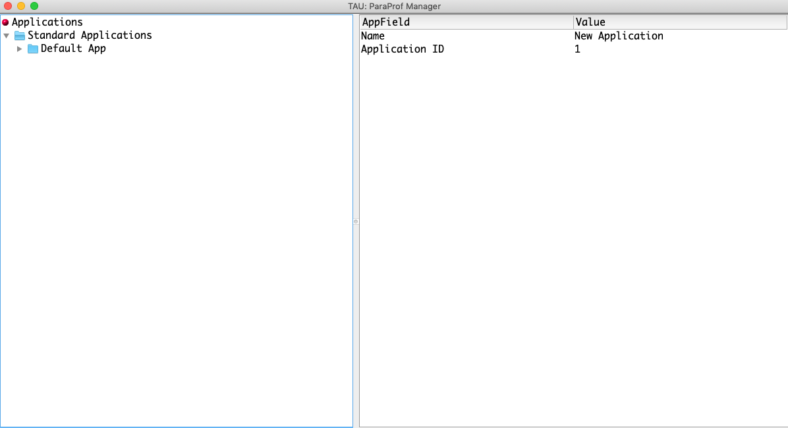

2. Open the profiles and select the dataset

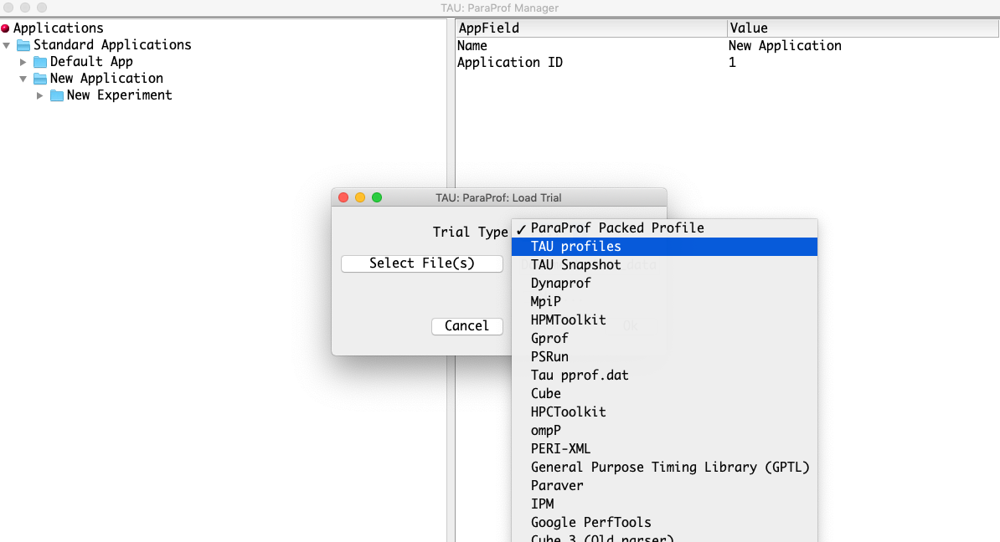

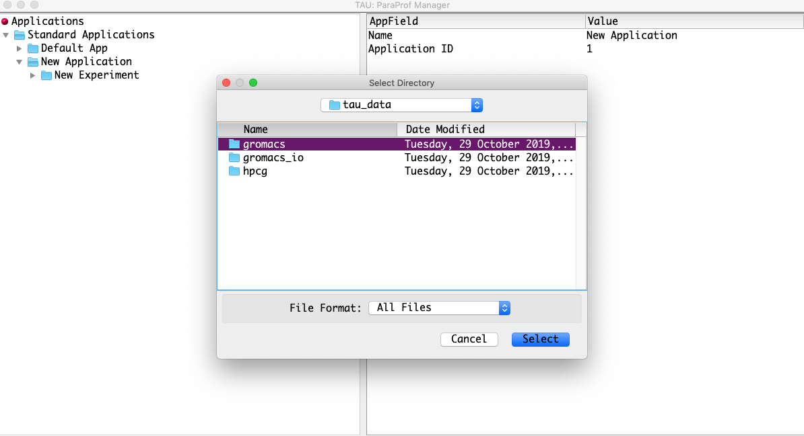

---

#### Benchmark application for MPI + OpenMP : Gromacs (CPU only)

The sample script for profiling gromacs : 

``` 
#!/bin/bash

#BATCH --job-name="benchmarking_gromacs"
#SBATCH --time=00:30:00
#SBATCH -N 2
#SBATCH -p short

module purge
module load 2019
module load GROMACS/2019.3-foss-2018b
module load PAPI/5.7.0-GCCcore-7.3.0
module load PDT/3.25-foss-2018b
module load CMake/3.12.1-GCCcore-7.3.0

#set TAU environment
export TAU_HOME=/home/path/to/tau-2.28.2/build/x86_64
export TAU_MAKEFILE=/home/path/to/tau-2.28.2/build/x86_64/lib/Makefile.tau-papi-ompt-tr4-mpi-pdt-openmp
export PATH=$TAU_HOME/bin:$PATH

export TAU_COMM_MATRIX=1
export TAU_THROTTLE=1
export OMP_NUM_THREADS=4
export TRACK_MEMORY_FOOTPRINT=1
export TAU_SAMPLING=1
export TAU_VERBOSE=1
export TAU_OMPT_SUPPORT_LEVEL=full
export TAU_OMPT_RESOLVE_ADDRESS_EAGERLY=1


mpirun -n 16 -x OMP_NUM_THREADS tau_exec -T ompt -ompt gmx_mpi mdrun -s lignocellulose-rf.tpr -maxh 0.1 -resethway -noconfout -nsteps 50000 -g logfile

```
For profiling memory allocation, change the mpirun command to include -memory options. 

```
mpirun -n 16 -x OMP_NUM_THREADS tau_exec -T ompt -ompt -memory gmx_mpi mdrun -s lignocellulose-rf.tpr -maxh 0.1 -resethway -noconfout -nsteps 50000 -g logfile

```
MPI calls are profiled by default. For OpenMP profiling calls we need to add -ompt flag as shown above. 

1. Flat profiles 

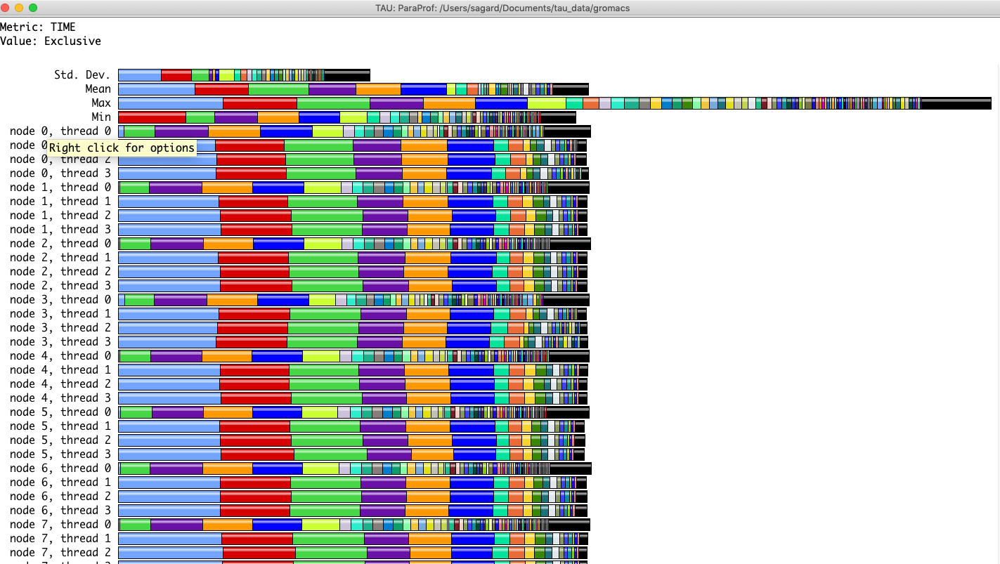

2. Context event window 

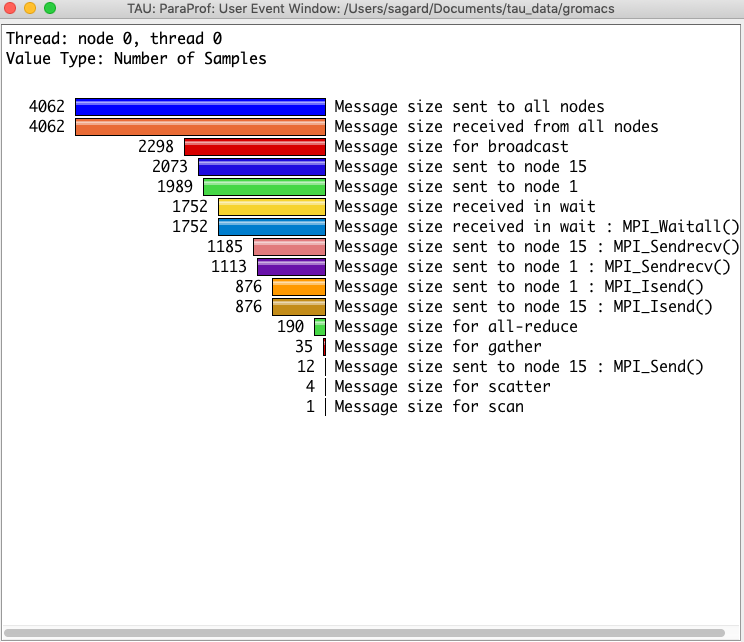

3. Visualisation 

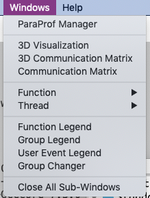

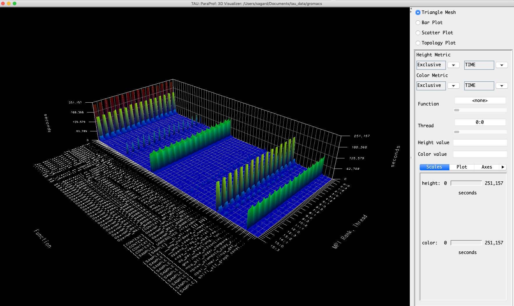

4. Context event winwdow in case of profiling with -memory option 

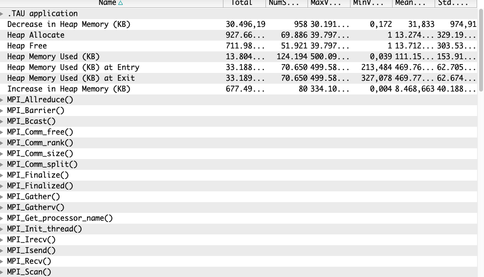


#### Benchmark application for MPI + OpenMP + CUDA : Gromacs (CPU + GPU)

1. GPU Profile 

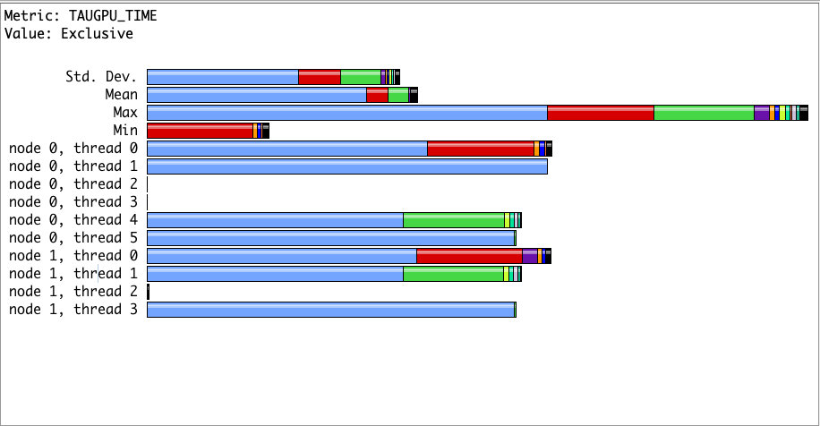

2. STacked GPU Profiles 

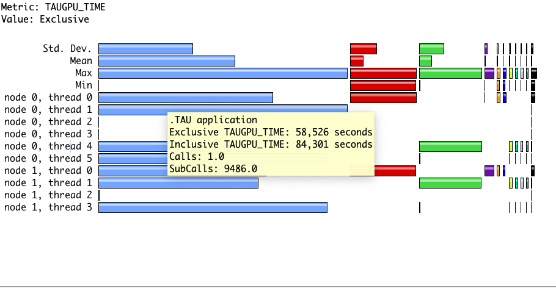

3. User Event Window for GPU 

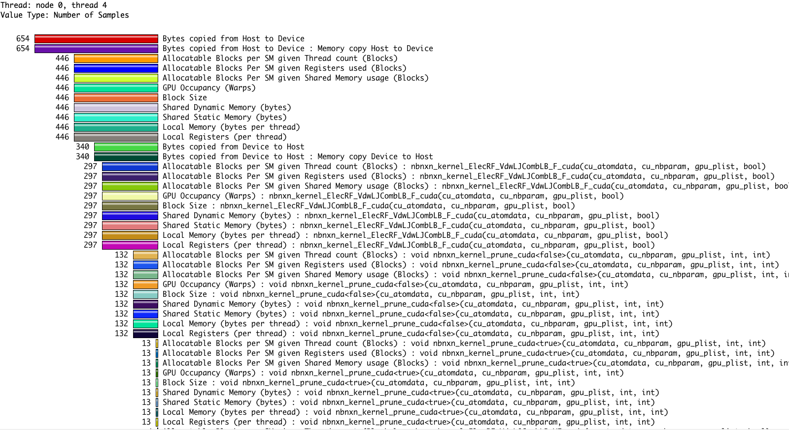

4. Context event window for GPU 

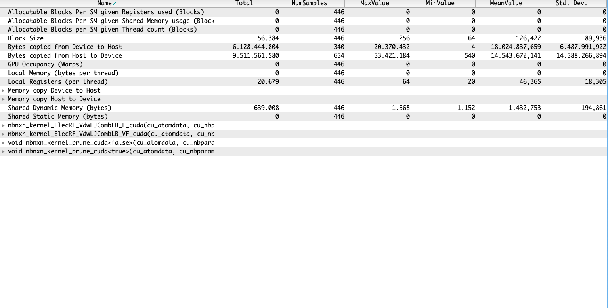


#### Benchmark application for MPI + OpenMP + CUDA + Python : Tensorflow with Horovod + MPI with CUDA support 

Coming soon !!!


